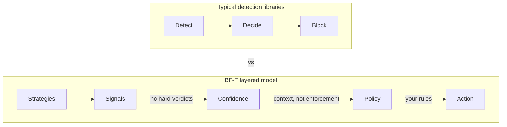
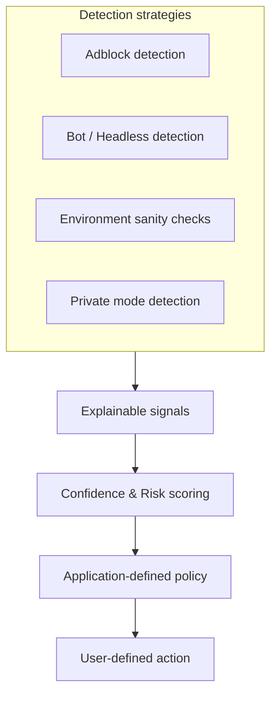

# Browser Fingerprinting Framework: Your browser's BFF

**BF-F** is a modular, fully open-source framework for **client-side browser fingerprinting and detection**.

It helps you identify:

* Ad blockers and privacy extensions
* Automated and headless browsers
* Tampered or anomalous runtime environments

BF-F focuses on producing **raw, explainable detection signals** with **confidence scoring**, not verdicts.

> BF-F is a **signal engine**.
> You decide how _(or if)_ those signals are enforced.

### Live demo

See BF-F in action:

**[Try the demo](https://piyushraj.org/works/bff)**

### How it compares

BF-F is best understood as an **open-source alternative** to:

* [fingerprintjs/fingerprintjs](https://github.com/fingerprintjs/fingerprintjs) (fingerprinting)
* [fingerprintjs/BotD](https://github.com/fingerprintjs/BotD) (bot detection)

...but without:

* Opaque scoring
* Closed heuristics
* Vendor lock-in
* Forced server-side enforcement

Everything runs **client-side** and everything is **inspectable**.

### What BF-F is _not_

BF-F is **not** a `User-Agent` parser.

Libraries like [UAParser.js](https://github.com/faisalman/ua-parser-js) extract declared metadata from `navigator.userAgent`. BF-F detects **observed behavior and inconsistencies**.

> Parsing tells you what the browser *claims* to be.
> Fingerprinting tells you what it *actually is*.

## Why another detection library?

The browser detection ecosystem is fragmented, largely outdated and often brittle, opaque or hard to audit.

BF-F was built to address these issues emphasizing **modular, not monolithic** design and being **policy-agnostic, not authoritarian**.

### 1. Adblock detection is brittle and unmaintained

Most open-source adblock detection libraries rely on legacy tricks that no longer work reliably across modern browsers and extensions. Many are unmaintained or easily bypassed, for example:

* [FuckAdBlock](https://github.com/sitexw/FuckAdBlock)
* [BlockAdBlock](https://github.com/sitexw/BlockAdBlock)
* [adblock-detect-javascript-only](https://github.com/NikolaiT/adblock-detect-javascript-only)
* [just-detect-adblock](https://github.com/wmcmurray/just-detect-adblock)

BF-F approaches adblock detection as **one signal among many** utilising various techniques instead of a single fragile heuristic.

### 2. Private / Incognito mode detection lacks a standard solution

There is currently **no widely accepted, open-source library** for detecting private or incognito browsing modes across browsers.

Implementations are scattered, inconsistent and browser-specific. BF-F consolidates these techniques into a **maintained, testable, modular signal**, rather than one-off snippets.

### 3. Bot detection is too often just User-Agent parsing

Many open-source bot detection libraries depend heavily, sometimes entirely on `navigator.userAgent`. This makes them trivial to evade.

BF-F treats User-Agent data as **optional context** and NOT a _source of truth_.

Instead, it performs:

* Feature detection
* Environment sanity checks
* Behavioral and runtime consistency tests

### In short

BF-F exists because:

* Existing tools are **narrow, brittle, or opaque**
* Modern detection requires **composable signals** NOT hardcoded verdicts
* Developers need **control, transparency and extensibility**

## Core idea

Most detection libraries mix everything together:



BF-F deliberately splits this into layers:



This gives you:

* Fewer false positives
* Explainable decisions
* Tunable sensitivity
* Enterprise-friendly behavior

## Usage

Getting started with BF-F is easy:

### Node / bundlers

```ts
import BFF from '@bff/signals'

const result = await BFF.detect('bot')
```

or

```ts
import { createDefaultBFF } from '@bff/signals'

const engine = createDefaultBFF()
```

### Example (browser)

```html
<script src="./dist/browser.global.js"></script>
<script>
(async () => {
  const adblock = await BFF.detect('adblock')
  const bot = await BFF.detect('bot')

  console.log(adblock)
  console.log(bot)
})()
</script>
```

#### Example result

```json
{
  "blocked": false,
  "confidence": 0.00,
  "signals": [
    {
      "strategy": "adblock:dom",
      "block": false,
      "weight": 1
    }
  ]
}
```

> Note: Confidence is a suspicion score, not a success indicator.

| Confidence | Meaning                        |
| ---------- | ------------------------------ |
| `0.00`     | No suspicious signals detected |
| `0.25`     | Weak suspicion                 |
| `0.50`     | Uncertain                      |
| `0.75`     | Strong suspicion               |
| `1.00`     | Very strong suspicion          |

## Detection categories

BF-F currently supports:

### Adblock detection

* Script bait detection
* DOM bait hiding
* (Extensible to network & timing probes)

### Bot / automation detection

* `navigator.webdriver`
* Headless browser globals
* Feature sanity checks

Each check is implemented as a **strategy**.

## Strategy-based architecture

Every detection mechanism is a self-contained strategy:

```ts
{
  id: 'bot:webdriver',
  type: 'bot',
  run(ctx) {
    return {
      block: ctx.navigator.webdriver === true,
      weight: 3
    }
  }
}
```

You can easily:

* Add strategies
* Remove strategies
* Weight strategies differently
* Ship different presets

## Design philosophy

BF-F is built on a few key principles:

* Detection is probabilistic, not binary
* Blocking is contextual: the application decides how to respond
* False positives are worse than misses
* Applications know best how to react

These principles inform our **design goals**:

* Probabilistic and extensible strategies
* Explainable, auditable detection signals
* Future-ready, ML-compatible scoring

## Roadmap

- [ ] Strategy weighting (in progress)
- [ ] Policy engine (`block if confidence >= X`)
